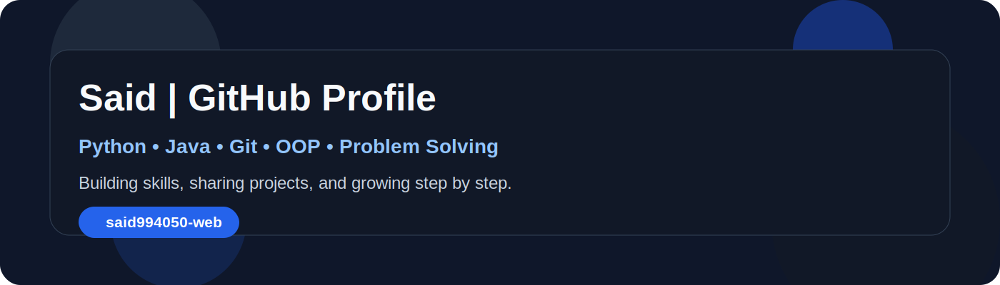

<h1 align="center">Hi 👋, I'm Said</h1>
<h3 align="center">Python & Java Developer | Problem Solver | Passionate about Programming</h3>

  

  
  

---

## 👨‍💻 About Me
- 🔭 I’m currently building my programming skills and sharing my work on GitHub.
- 🌱 I’m focusing on **Python, Java, OOP, Git, and Problem Solving**.
- 💡 I enjoy learning new technologies and improving my coding skills step by step.
- 📫 Reach me at: **said994050@gmail.com**

---

## 🚀 Skills

  
  
  
  
  

---

## 📌 Featured Focus
- Python projects
- Java basics and OOP practice
- Git & GitHub workflow
- Problem solving and logic building

---

## 📊 GitHub Stats

  

  

---

## 🌐 Connect With Me
- GitHub: [said994050-web](https://github.com/said994050-web)
- Email: [said994050@gmail.com](mailto:said994050@gmail.com)

---

Thanks for visiting my profile ✨

